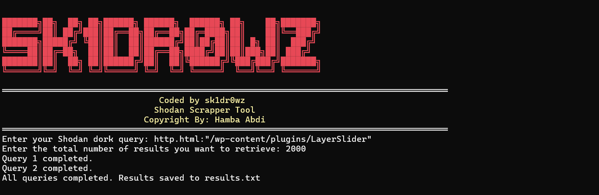

# Shodan_Scrapper
Shodan Scrapper is a command-line utility designed to streamline the process of searching for devices using the Shodan search engine. Using a list of dorks and saving the resulting IP addresses to a file.

# Requirements

- Python 3.x
- Shodan API key (get it [here](https://account.shodan.io/register))

# Installation
```
git clone https://github.com/Sk1dr0wz/Shodan_Scrapper.git
cd Shodan_Scrapper
pip intstall -r requirements.txt
```

# API
```
You need to fill yours Shodan API in config.ini before run the tool .
```

# How To Run
```
python3 dork.py [-h] -q QUERY [-t TOTAL_RESULTS]
Example : python3 dork.py -q port:3306 -t 1000
```

# Tool View



# Credit
* [Hamba Abdi]
